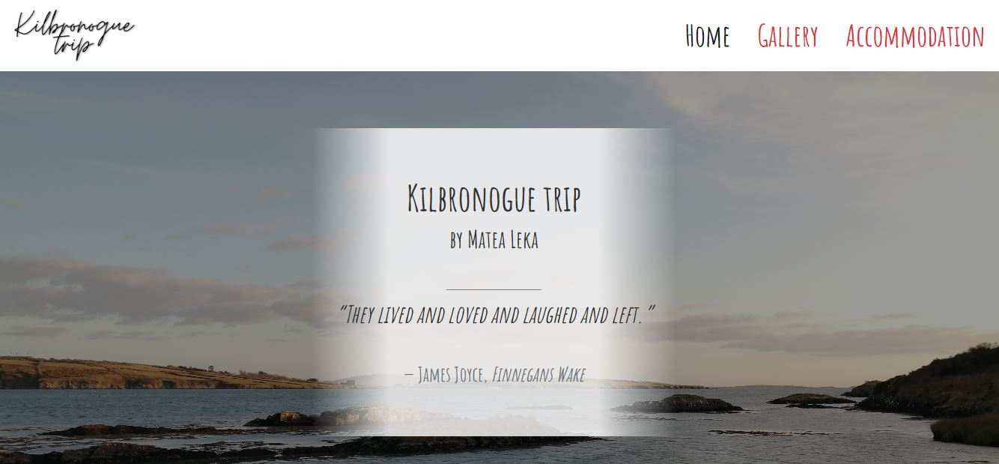

# Kilbronogue trip

**Code Institute - Milestone Project for User-Centric Frontend Development**

[View webpage in GitHub Pages](https://github.com/GilleM/Kilbronogue_trip)

Welcome to my first Code Institute milestone project that you can check out by the click on the photo below:

## Project Description
***
Kilbronogue trip is the project I took as the first out of four Milestone Projects at The Code Institute 
Full Stack Developer course.
the main requirements were to make a responsive and static website with a minimum
of 3 pages using HTML5 and CSS3, along with any other technologies you would like to use.

The choice of the first milestone's subject took me a lot of time.  I spent hours trying to figure out what 
would make me happy to write about, subject I have enough materials (information and photos) about,
and finally, the overall structure what my project will have in order to represent the best my intentions - to demonstrate
my time in Kilbronogue, in West Cork, where I spent lovely several months of my life during lock-down.

The audience I chose are my friends, family and people interested in West Cork and travels. 

##  UX
***
According to [interaction design page](https://www.interaction-design.org/literature/topics/ux-design), user 
experience (UX) design is _"the process design teams use to create products that provide meaningful and relevant 
experiences to users. This involves the design of the entire process of acquiring and integrating the product, 
including aspects of branding, design, usability and function."_

I wanted to make my project useful, usable and valuable.

Five pillars of my project plan went like this:

1.	The **strategy plane**: My aim was to make a memory of my Kilbronogue trip in the first place, for me and for my friend closely related to that place.
2.	The **scope plane**: The features I decided to include, based on information from the strategy plane, is 
    to represent myself firstly and name the activites we did, to do a gallery page just with the picture, as well as
    accommodation page where I could represent the house (info's are invented) in order to practice forms and bullets.
    It was the first time I included a map.
3.	The **structure plane**: The information is structured in three pages each one having the same navigation link but 
    different footer. 
    * First page - index.html (Home) is quite basic, with jumbotron and and quote, followed by information
    about me and some activites photos and paragraph.
    * Second page - gallery.html (Gallery) is a page I'm really happy how it looks like. I borrowed the link from a page 
    (everything will be stated below) and I changed the design. I colored it differently, and I introduced overflow-x: scroll;
    to make it look better.
    * Third page - accommodation.html (Accommodation) in composed in more divs. First is the picture of the house followed
    by quote. There is a name etimology table. Form pushed left and map pushed right are included in the latest div. 
    I decided to change the footer so I could introduce accommodation address and provide links. 
4.	The **skeleton plane**: I tried my best to nicely arrange and visual present the elements. The user can navigate 
    to the information and the features quite easily. In order to know how well constructed my information 
    architecture is and also the arrangement of our features, I created mock-ups using [Balsamiq](https://balsamiq.com/?gclid=CjwKCAiA4o79BRBvEiwAjteoYP-BL8x2zPrc_Xa7JT-E3IZN4kkktcwmJJhUxVjhi-rTzlgNLc4jvxoCWOoQAvD_BwE).
5.	The **surface plane**: I decided to use mostly greyish and white colours with some dark red and beige.
    I tried to follow this decicion throughout all the pages. I really liked _Amatic SC, cursive_ font which I combined
    with _Playfair Display_ font.

## Wireframe
***

[LARGE SIZE WIREFRAME for all pages](assets/documents/readme.html)

[MEDIUM SIZE WIREFRAME for all pages]
[EXTRA-SMALL SIZE WIREFRAME for all pages]  

## Technology used
***

Thos project was written in **HTML5**, **CSS3** and **Bootstrap** using the caracteristics like [Google fonts](https://fonts.google.com/), [Font Awesome](https://fontawesome.com/)

I did everything using **Github** and its **Gitpod editor**.

When doing my web page, I consulted the following web pages/link:
- [Bootsnip](https://bootsnipp.com/snippets/P2gor) that helped me to develop my gallery.html page
- [Online PNG tools](https://onlinepngtools.com/create-transparent-png) to make transparent the background of the divider
- [Norwegian photo](https://www.lifeinnorway.net/norwegian-mythology-folk-tales/) for the photo of norwegian flag I used in index.html page
- [Divider photo](https://www.freepik.com/vectors/background) - Background vector created by rawpixel.com - www.freepik.com **IN PROCESS**

